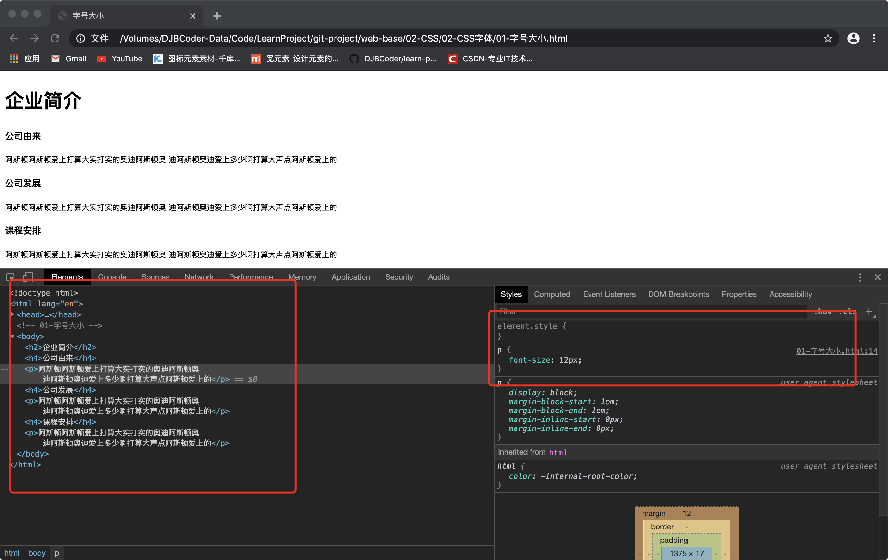

@[toc](初识CSS)

# CSS基础
&emsp;&emsp;CSS(Cascading Style Sheets)通常称为CSS样式表或层叠样式表（级联样式表），主要用于设置HTML页面中的文本内容（字体、大小、对齐方式等）、图片的外形（宽高、边框样式、边距等）以及版面的布局等外观显示样式。

&emsp;&emsp;CSS以HTML为基础，提供了丰富的功能，如字体、颜色、背景的控制及整体排版等，而且还可以针对不同的浏览器设置不同的样式。CSS的最大贡献就是让HTML从样式中解脱出来，实现了HTML专注去做结构呈现，而样式交给CSS。

## CSS样式规则
&emsp;&emsp;使用HTML时，需要遵从一定的规范。CSS亦如此，要想熟练地使用CSS对网页进行修饰，首先需要了解CSS样式规则，具体格式如下：


&emsp;&emsp;在上面的样式规则中:

1. 选择器用于指定CSS样式作用的HTML对象，花括号内是对该对象设置的具体样式。
2. 属性和属性值以“键值对”的形式出现。
3. 属性是对指定的对象设置的样式属性，例如字体大小、文本颜色等。
4. 属性和属性值之间用英文“:”连接。
5. 多个“键值对”之间用英文“;”进行区分。

## CSS注释
&emsp;&emsp;CSS的注释和HTML注释的作用相同，格式如下：

```css
/* 注释的内容 */
```

# CSS引入方法
## 内部样式表
&emsp;&emsp;内嵌式是将CSS代码集中写在HTML文档的head头部标签中，并且用style标签定义，其基本语法格式如下：

```html
<head>
<style type="text/CSS">
    选择器 {属性1:属性值1; 属性2:属性值2; 属性3:属性值3;}
</style>
</head>
```

&emsp;&emsp;style标签一般位于head标签中title标签之后，也可以把它放在HTML文档的任何地方。

> *__注意：__* type="text/CSS"  在html5中可以省略， 写上也比较符合规范， 所以这个地方可以写也可以省略。

## 行内式（内联样式）
&emsp;&emsp;内联样式，又称行内样式、行间样式、内嵌样式，是通过标签的style属性来设置元素的样式，其基本语法格式如下：

```html
<标签名 style="属性1:属性值1; 属性2:属性值2; 属性3:属性值3;"> 内容 </标签名>
```

&emsp;&emsp;语法中style是标签的属性，实际上任何HTML标签都拥有style属性，用来设置行内式。其中属性和值的书写规范与CSS样式规则相同，行内式只对其所在的标签及嵌套在其中的子标签起作用。

## 外部样式表（外链式）
&emsp;&emsp;链入式是将所有的样式放在一个或多个以.CSS为扩展名的外部样式表文件中，通过link标签将外部样式表文件链接到HTML文档中，其基本语法格式如下：

```html
<head>
  <link href="CSS文件的路径" type="text/CSS" rel="stylesheet" />
</head>
```

&emsp;&emsp;该语法中，link标签需要放在head头部标签中，并且必须指定link标签的三个属性，具体如下：

+ href：定义所链接外部样式表文件的URL，可以是相对路径，也可以是绝对路径。
+ type：定义所链接文档的类型，在这里需要指定为“text/CSS”，表示链接的外部文件为CSS样式表。
+ rel：定义当前文档与被链接文档之间的关系，在这里需要指定为“stylesheet”，表示被链接的文档是一个样式表文件。

## 三种样式表总结

样式表 | 优点| 缺点 | 使用情况  | 控制范围
- | - |- |- | -
行内样式表 | 书写方便，权重高 | 没有实现样式和结构相分离 | 较少| 控制一个标签（少）
内部样式表 | 部分结构和样式相分离   | 没有彻底分离 | 较多 | 控制一个页面（中）
外部样式表 | 完全实现结构和样式相分离 | 需要引入 | 最多，强烈推荐 | 控制整个站点（多）

# 开发者工具（chrome）
&emsp;&emsp;这是前端开发的必备工具，以后代码出了问题，就可以打开它进行查看，打开方式如下：

+ “按F12”或者是 “shift+ctrl+i”打开开发者工具
+ 右击网页空白在弹出的对话框中选择“查看”



> *__小技巧__*
> 1. ctrl+滚轮可以放大开发者工具代码大小。
> 2. 左边是HTML元素结构，右边是CSS样式。
> 3. 右边CSS样式可以改动数值和颜色查看更改后效果。
