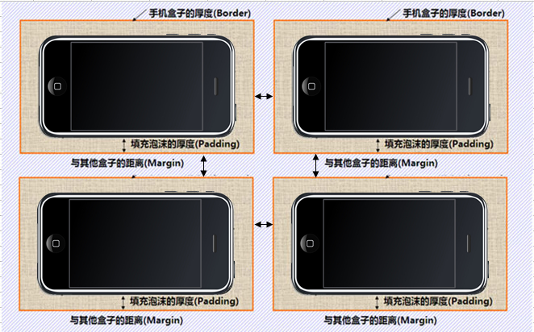
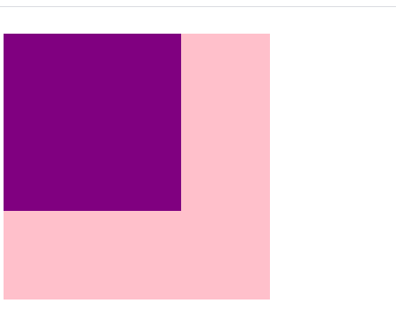

@[toc](盒子模型)

# 基础知识
## 网页布局的本质
&emsp;&emsp;其实CSS就三个大模块：

+ 盒子模型
+ 浮动
+ 定位

&emsp;&emsp;其余的都是细节。所谓盒子模型就是把HTML页面中的元素看作是一个矩形的盒子，也就是一个盛装内容的容器。每个矩形都由元素的内容、内边距（padding）、边框（border）和外边距（margin）组成。

&emsp;&emsp;网页布局的本质就是把网页元素（比如：文字图片等等）放入盒子里面，然后利用CSS摆放盒子的过程。

## 盒子模型

&emsp;&emsp;所有的文档元素（标签）都会生成一个矩形框，我们称为元素框（element box），它描述了一个文档元素在网页布局汇总所占的位置大小。因此，<strong style="color: #f00;">每个盒子除了有自己大小和位置外，还影响着其他盒子的大小和位置。</strong>




# 盒子边框
&emsp;&emsp;语法：

```css
border : border-width || border-style || border-color
```

&emsp;&emsp;边框样式（border-style）用于定义页面中边框的风格，常用属性值如下：

+ none：没有边框即忽略所有边框的宽度（默认值）
+ solid：边框为单实线(最为常用的)
+ dashed：边框为虚线  
+ dotted：边框为点线
+ double：边框为双实线

```html
<!DOCTYPE html>
<html lang="en">
<head>
    <meta charset="UTF-8">
    <meta name="viewport" content="width=device-width, initial-scale=1.0">
    <title>Document</title>
    <style>
        div {
            border-width: 3px;
            border-color: red;
            border-style: dashed;
        }
    </style>
</head>
<body>
    <div>这里是一段文本</div>
</body>
</html>
```

## 盒子边框写法总结

设置内容|样式属性|常用属性值
-|-|-
上边框|border-top-style:样式；border-top-width:宽度;border-top-color:颜色;border-top:宽度 样式 颜色; |
下边框 | border-bottom-style:样式;border- bottom-width:宽度;border- bottom-color:颜色;border-bottom:宽度 样式 颜色; |
左边框 | border-left-style:样式; border-left-width:宽度;border-left-color:颜色;border-left:宽度 样式 颜色; |
右边框 | border-right-style:样式;border-right-width:宽度;border-right-color:颜色;border-right:宽度 样式 颜色; |
样式综合设置 | border-style:上边 [右边 下边 左边]; | none无（默认）、solid单实线、dashed虚线、dotted点线、double双实线
宽度综合设置 | border-width:上边 [右边 下边 左边]; | 像素值
颜色综合设置 | border-color:上边 [右边 下边 左边]; | 颜色值、#十六进制、rgb(r,g,b)、rgb(r%,g%,b%)
边框综合设置 | border:四边宽度 四边样式 四边颜色; |

## 表格的细线边框
&emsp;&emsp;"border-collapse:collapse; " 表示边框合并在一起。

```html
<!DOCTYPE html>
<html lang="en">
<head>
    <meta charset="UTF-8">
    <meta name="viewport" content="width=device-width, initial-scale=1.0">
    <title>Document</title>
    <style>
        table {
            border-collapse: collapse;
            border : solid black 1px;
        }
        table td ,
        table th {
            border: 1px solid black;
            padding: 20px;
        }
    </style>
</head>
<body>
    <table>
        <tr>
            <th>姓名</th>
            <th>性别</th>
            <th>年龄</th>
        </tr>
        <tr>
            <td>张三</td>
            <td>男</td>
            <td>12</td>
        </tr>
        <tr>
            <td>张三</td>
            <td>男</td>
            <td>12</td>
        </tr>
        <tr>
            <td>张三</td>
            <td>男</td>
            <td>12</td>
        </tr>
    </table>
</body>
</html>
```

## 圆角边框（CSS3）
&emsp;&emsp;语法格式：

```css
border-radius: 左上角  右上角  右下角  左下角;
```

```html
<!DOCTYPE html>
<html lang="en">
<head>
    <meta charset="UTF-8">
    <meta name="viewport" content="width=device-width, initial-scale=1.0">
    <title>Document</title>
    <style>
        div {
            width: 200px;
            height: 200px;
            border: 1px solid red;
        }
        div:first-child {
            border-radius: 10px;  
            /*  一个数值表示4个角都是相同的 10px 的弧度 */ 
        }
        div:nth-child(2) {
            /*border-radius: 100px;    取宽度和高度 一半  则会变成一个圆形 */
			border-radius: 50%;   /*  100px   50% 取宽度和高度 一半  则会变成一个圆形 */
        }
        div:nth-child(3) {
            border-radius: 10px 40px;  /* 左上角  和 右下角  是 10px  右上角 左下角 40 对角线 */
        }
        div:nth-child(4) {
            border-radius: 10px 40px  80px;   /* 左上角 10    右上角  左下角 40   右下角80 */
        }
        div:nth-child(5) {
            border-radius: 10px 40px  80px  100px;   /* 左上角 10    右上角 40  右下角 80   左下角   右下角100 */
        }
        div:nth-child(6) {
            border-radius: 100px;  
			height: 100px; 
        }
        div:last-child {
            border-radius: 100px 0;
        }
    </style>
</head>
<body>
    <div></div>
    <div></div>
    <div></div>
    <div></div>
    <div></div>
    <div></div>
    <div></div>
</body>
</html>
```

# 内外边距
## 内边距
&emsp;&emsp;padding属性用于设置内边距，内边距是指边框与内容之间的距离。

+ padding-top：上内边距
+ padding-right：右内边距
+ padding-bottom：下内边距
+ padding-left：左内边距

值的个数 | 表达意思
-|-
1个值 | padding：上下左右边距，比如： *__padding: 3px;__* 表示上下左右都是3像素
2个值 | padding: 上下边距 左右边距，比如： *__padding: 3px 5px;__* 表示上下3像素、左右5像素
3个值 | padding：上边距 左右边距 下边距，比如：*__padding: 3px 5px 10px;__* 表示上是3像素、左右是5像素、下是10像素
4个值 | padding：上内边距 右内边距 下内边距 左内边距，比如: *__padding: 3px 5px 10px 15px;__* 表示上3px、右是5px、下10px、左15px

```html
<!DOCTYPE html>
<html lang="en">
<head>
    <meta charset="UTF-8">
    <meta name="viewport" content="width=device-width, initial-scale=1.0">
    <title>Document</title>
    <style>
        nav {
            height: 41px;
            background-color: #FCFCFC;
            border-top: 3px solid #FF8500;
            border-bottom: 1px solid #EDEEF0;
        }
        a {
            text-decoration: none;
            color: #4c4c4c;
            font-size: 14px; 
            padding: 0 15px;
            display: inline-block;
            height: 41px;  
            line-height: 41px;  
        }
        a:hover {
            background-color: #ccc;
        }
    </style>
</head>
<body>
    <nav>
        <a href="#">首页</a>
        <a href="#">手机新浪网</a>
        <a href="#">网站导航</a>
        <a href="#">关注我</a>
    </nav>
</body>
</html>
```

## 外边距
&emsp;&emsp;margin属性用于设置外边距，设置外边距会在元素之间创建“空白”，这段空白通常不能放置其他内容。

+ margin-top：上外边距
+ margin-right：右外边距
+ margin-bottom：下外边距
+ margin-left：上外边距
+ margin：上外边距 右外边距 下外边距 左外边

> 取值顺序跟内边距相同

&emsp;&emsp;外边距可以让一个盒子实现水平居中,需要满足一下两个条件:

1. 必须是块级元素
2. 盒子必须指定了宽度（width）

&emsp;&emsp;然后就给左右的外边距都设置为auto，就可使块级元素水平居中。

```html
<!DOCTYPE html>
<html lang="en">
<head>
    <meta charset="UTF-8">
    <meta name="viewport" content="width=device-width, initial-scale=1.0">
    <title>Document</title>
    <style>
        div {
            height: 100px;
            width: 100px;
            margin: 0 auto;
            background-color: red;
        }
    </style>
</head>
<body>
    <div></div>
</body>
</html>
```

实际工作中常用这种方式进行网页布局，示例代码如下：

```css
.header{ width:960px; margin:0 auto;}
```

### 图片、背景文字和盒子对齐的区别

1. 文字水平居中和盒子水平居中

+ 文字水平居中：text-align: center;
+ 盒子水平居中：左右margin为auto

```html
<!DOCTYPE html>
<html lang="en">
<head>
    <meta charset="UTF-8">
    <meta name="viewport" content="width=device-width, initial-scale=1.0">
    <title>Document</title>
    <style>
        div {
            width: 300px;
            height: 100px;
            border: 1px solid pink;
            /* 文字水平居中 */
            text-align: center;
            /* 盒子水平居中 */
            margin: 0 auto;
        }
    </style>
</head>
<body>
    <div>
        文字水平居中
    </div>
</body>
</html>
```

2. 插入图片和背景图片

+ 插入图片：用的最多，比如：产品展示类
+ 背景图片：一般用于小图标背景或者超大背景图片
```html
<!DOCTYPE html>
<html lang="en">
<head>
    <meta charset="UTF-8">
    <meta name="viewport" content="width=device-width, initial-scale=1.0">
    <title>Document</title>
    <style>
        section {
            width: 300px;
            height: 300px;
            border: 1px solid #000;
            /* 背景图片 */
            background-image: url(./ms.jpg);
            /* 背景图片大小 */
            background-size: 80px;
            /* 不重复 */
            background-repeat: no-repeat;
            /* 改变位置 */
            background-position: 150px 150px;
        }
        
        section img {
            /* 插入图片更改大小 */
            width: 80px;

            /* 更改位置 */
            margin-top: 30px;
        }
    </style>
</head>
<body>
    <section>
        <!-- 插入图片 -->
        
    </section>
</body>
</html>
```

### 外边距合并
&emsp;&emsp;使用margin定义块元素的垂直外边距时，可能会出现外边距的合并。

1. 相邻块元素垂直外边距的合并

&emsp;&emsp;当上下相邻的两个块元素相遇时，如果上面的元素有下外边距margin-bottom，下面的元素有上外边距margin-top，则它们之间的垂直间距不是margin-bottom与margin-top之和，而是两者中的较大者。这种现象被称为相邻块元素垂直外边距的合并（也称外边距塌陷）。


```html
<!DOCTYPE html>
<html lang="en">
<head>
    <meta charset="UTF-8">
    <meta name="viewport" content="width=device-width, initial-scale=1.0">
    <title>Document</title>
    <style>
       div {
           width: 200px;
           height: 200px;
           background-color: pink;
       }
       div:first-child {
           margin-bottom: 100px;
       }
       div:last-child {
           background-color: purple;
           margin-top: 50px;
       }
    </style>
</head>
<body>
    <!-- 中间的距离是100px -->
    <div></div>
    <div></div>
</body>
</html>
```

&emsp;&emsp;解决方法：避免出现这种情况，将需要距离给一个就可以了，比如上面的案例，如果想距离是150px，直接给上面的div设置下边距为150px，或者直接给下面的div设置上边距为150px即可。

2. 嵌套块元素垂直外边距的合并

&emsp;&emsp;对于两个嵌套关系的块元素，如果父元素没有上内边距及边框，则父元素的上外边距会与子元素的上外边距发生合并，合并后的外边距为两者中的较大者，即使父元素的上外边距为0，也会发生合并。


```html
<!DOCTYPE html>
<html lang="en">
<head>
    <meta charset="UTF-8">
    <meta name="viewport" content="width=device-width, initial-scale=1.0">
    <title>Document</title>
    <style>
       .father {
           width: 300px;
           height: 300px;
           background-color: pink;
           /* 如果不设置，则是上边距为30px
           如果设置小于30px，则使用30px
           如果大于30px，则使用当前设定的值 */
           margin-top: 100px;
       }
       .child {
           width: 200px;
            height: 200px;
            background-color: purple;
            /* 外边距塌陷，小盒子没有30像素的距离 */
            margin-top: 30PX;
       }
    </style>
</head>
<body>
    <div class="father">
        <div class="child"></div>
    </div>
</body>
</html>
```



&emsp;&emsp;解决方案：

1. 可以为父元素定义1像素的上边框或上内边距。
2. 可以为父元素添加overflow:hidden。

```html
<!DOCTYPE html>
<html lang="en">
<head>
    <meta charset="UTF-8">
    <meta name="viewport" content="width=device-width, initial-scale=1.0">
    <title>Document</title>
    <style>
       .father {
           width: 300px;
           height: 300px;
           background-color: pink;
           margin-top: 100px;
           /* 方法1  设置边框 */
           /* border: 1px solid #000; */

           /* 方法2 设置内边距 */
           /* padding-top: 1px; */

           /* 方法3 设置overflow */
           overflow: hidden;
       }
       .child {
           width: 200px;
            height: 200px;
            background-color: purple;
            margin-top: 30PX;
       }
    </style>
</head>
<body>
    <div class="father">
        <div class="child"></div>
    </div>
</body>
</html>
```

## 清除元素的默认内外边距
&emsp;&emsp;为了更方便地控制网页中的元素（有的浏览器会有默认的边框），制作网页时可使用如下代码清除元素的默认内外边距： 

```css
* {
   padding:0;         /* 清除内边距 */
   margin:0;          /* 清除外边距 */
}
```

> *__注意：__* 行内元素是只有左右外边距的，没有上下外边距的。内边距在ie6等低版本浏览器也会有问题，所以尽量不要给行内元素指定上下的内外边距就好了。

## 盒子模型的宽度和高度
&emsp;&emsp;使用宽度属性width和高度属性height可以对盒子的大小进行控制。width和height的属性值可以为不同单位的数值或相对于父元素的百分比%，实际工作中最常用的是像素值。大多数浏览器，如Firefox、IE6及以上版本都采用了W3C规范，符合CSS规范的盒子模型的总宽度和总高度的计算原则是：

+ 外盒尺寸计算（元素空间尺寸）
  + Element空间高度 = content height + padding + border + margin
  + Element 空间宽度 = content width + padding + border + margin

+ 内盒尺寸计算（元素实际大小）
  + Element Height = content height + padding + border （Height为内容高度）
  + Element Width = content width + padding + border （Width为内容宽度）


> *__注意：__*
> 1. 宽度属性width和高度属性height仅适用于块级元素，对行内元素无效（ img 标签和 input除外）。
> 2. 计算盒子模型的总高度时，还应考虑上下两个盒子垂直外边距合并的情况。
> 3. *__如果一个盒子没有给定宽度/高度或者继承父亲的宽度/高度，则padding不会影响本盒子大小__*。

## 盒子模型布局的稳定性
&emsp;&emsp;学习盒子模型最大的困惑就是分不清内外边距的使用，什么情况下使用内边距，什么情况下使用外边距。

&emsp;&emsp;大部分情况下是可以混用的，就是说你用内边距也可以，用外边距也可以，觉得哪个方便就用哪个。根据稳定性来分，建议如下优先使用：  

1. 宽度（width）
2. 内边距（padding）
3. 外边距（margin）   

&emsp;&emsp;原因：

+ margin：会有外边距合并，并且ie6下面margin问题更多，所以最后使用。
+ padding：会影响盒子大小，需要进行加减计算，所以其次使用
+ width：没有问题，经常使用宽度剩余法、高度剩余法来做

# CSS3盒模型
&emsp;&emsp;CSS3中可以通过box-sizing来指定盒模型，即可指定为content-box、border-box，这样我们计算盒子大小的方式就发生了改变。可以分成两种情况：

1. content-box：盒子大小为 *__width + padding + border__* ，此值为其默认值，其让元素维持W3C的标准Box Mode。

2. border-box：盒子大小为 *__width__* ，就是说padding和border是包含到width里面的。

> 注：上面的标注的width指的是CSS属性里设置的width: length，content的值是会自动调整的

```html
<!DOCTYPE html>
<html lang="en">
<head>
    <meta charset="UTF-8">
    <meta name="viewport" content="width=device-width, initial-scale=1.0">
    <title>Document</title>
    <style>
        div:first-child {
            width: 200px;
            height: 200px;
            background-color: pink;
            /*就是以前的盒子模型 padding 和 border 会撑开盒子*/
            /* box-sizing: content-box;  */
            /* 不会撑开盒子 */
            box-sizing: border-box;
            padding: 100px;
            border: 10px solid red;
        }
    </style>
</head>
<body>
    <div></div>
</body>
</html>
```

# 盒子阴影
&emsp;&emsp;语法格式：

```css
box-shadow:水平阴影 垂直阴影 模糊距离 阴影尺寸 阴影颜色  内/外阴影；
```


```html
<!DOCTYPE html>
<html lang="en">
<head>
    <meta charset="UTF-8">
    <meta name="viewport" content="width=device-width, initial-scale=1.0">
    <title>Document</title>
    <style>
        div {
            width: 200px;
            height: 200px;
            border: 10px solid red;
            /* box-shadow:水平位置 垂直位置 模糊距离 阴影尺寸（影子大小） 阴影颜色  内/外阴影； */
            box-shadow: 5px 5px 3px 4px rgba(0,0,0,.4);
        }
    </style>
</head>
<body>
    <div></div>
</body>
</html>
```

> 外阴影不能写outset，如果需要外阴影，直接省略不赋值就可以了。
