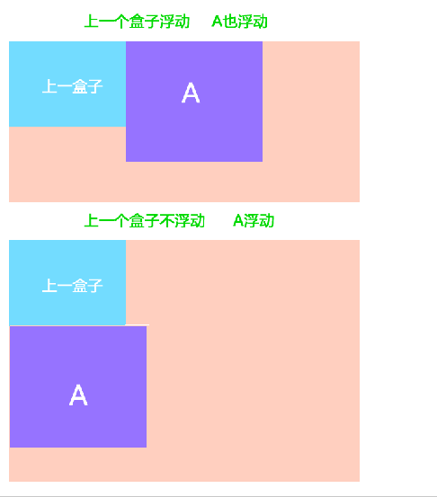
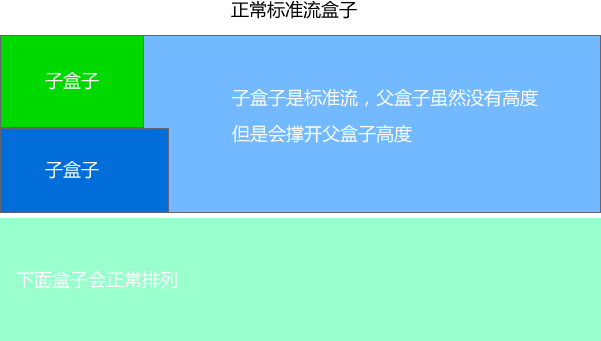

@[toc](浮动)

# 普通流（normal flow）
&emsp;&emsp;这个单词很多人翻译为文档流，字面翻译普通流或者标准流都可以。网页布局的核心，就是用CSS来摆放盒子位置。如何把盒子摆放到合适的位置？CSS的定位机制有3种：普通流（标准流）、浮动和定位。

&emsp;&emsp;普通流实际上就是一个网页内标签元素正常从上到下，从左到右排列顺序的意思，比如块级元素会独占一行，行内元素会按顺序依次前后排列；按照这种大前提的布局排列之下绝对不会出现例外的情况叫做普通流布局。

# 浮动（float）
&emsp;&emsp;浮动最早是用来控制图片，以便达到其它元素（特别是文字）实现“环绕”图片的效果。

```html
<!DOCTYPE html>
<html lang="en">
<head>
    <meta charset="UTF-8">
    <meta name="viewport" content="width=device-width, initial-scale=1.0">
    <title>Document</title>
    <style>
        div {
            width: 500px;
            height: 500px;
            border: 1px solid red;
            margin: 0 auto;
        } 
        img {
            float: right;
        }
    </style>
</head>
<body>
    <div>1991年1月，发行专辑《一起走过的日子》，
        专辑同名主打歌获得十大劲歌金曲奖以及十大中文
        金曲奖[116-117] ；2月，发行粤语专辑
        《爱不完》[118]  ；该专辑发行首日录音带的
        销量达到16万张，而激光唱片的销量则有7.2万
        张[119] ；6月，发行国语专辑《我和我追逐的梦》
        ；同年，获得十大劲歌金曲奖最受欢迎男歌手奖
        [116] 。 1992年，在洛杉矶、旧金山等地举行美
        加巡回演唱会；9月，发行加入 刘德华 刘德华
        (3张) 华纳唱片公司以后的首张专辑《真我的风采》
        ；该专辑发行后销量达到40万张[119] ；同年，在
        提前录制的央视春晚视频中，刘德华与毛阿敏合唱
        歌曲《心中常驻芳华》[120] ；此外，他还发行
        了专辑《谢谢你的爱》，同名主打歌曲获得第十六
        届十大中文金曲奖[121] 。 
        
        1993年1月至2月，
        在香港红袋体育馆举行20场“真我的风采演唱会”；
        4月，推出加入飞碟唱片公司后的首张专辑《真情
        难收》，其中的主打歌曲《一辈子的错》由刘德华
        作词；11月，推出专辑粤语专辑《答案就是你》，
        专辑中的歌曲《永远寂寞》获得第16届十大中文金
        曲获奖[121] 。 1994年，发行国语专辑《忘情
        水》，同名主打歌获得第17届十大中文金曲奖最
        受欢迎国语歌曲金奖以及第1届华语榜中榜Channe
        l [V]中文Top 20榜中榜歌曲奖[122-123] ；
        8月6日至25日，在香港红袋体育馆举行20场演唱
        会；11月25日，发行国语专辑《天意》；专辑中
        表达友情的主打歌曲《友谊历久一样浓》是刘德华
        个人填词的作品；同年，获得十大劲歌金曲奖最受
        欢迎男歌手奖[11] 。</div>
</body>
</html>
```

&emsp;&emsp;后来发现浮动有个很有意思的事情：就是让任何盒子可以一行排列，因此我们就慢慢的偏离主题，用浮动的特性来布局了。

## 什么浮动？
&emsp;&emsp;元素的浮动是指设置了浮动属性的元素会脱离标准普通流的控制，移动到其父元素中指定位置的过程。在CSS中，通过float属性来定义浮动，其基本语法格式如下：

```css
选择器 { float: 属性值; }
```

属性值 | 描述
-|-
left  | 元素向左浮动
right | 元素向右浮动
none  | 元素不浮动（默认值）

```html
<!DOCTYPE html>
<html lang="en">
<head>
    <meta charset="UTF-8">
    <meta name="viewport" content="width=device-width, initial-scale=1.0">
    <title>Document</title>
    <style>
        div {
            width: 200px;
            height: 200px;
            background-color: pink;
            float: left;
        }
        div:nth-child(2) {
            background-color: hotpink;
        }
        div:last-child {
            background-color: deeppink;
        }
    </style>
</head>
<body>
    <div></div>
    <div></div>
    <div></div>
</body>
</html>
```

## 浮动的特性

+ 浮动会脱离标准流，不占位置，会影响标准流
+ 浮动只有左右浮动

> *__注意：__* 浮动首先需要添加标准流父级别

```html
<!DOCTYPE html>
<html lang="en">
<head>
    <meta charset="UTF-8">
    <meta name="viewport" content="width=device-width, initial-scale=1.0">
    <title>Document</title>
    <style>
        .father {
            /* 父级别是标准流 */
            width: 500px;
            height: 500px;
            background-color : pink;
        }
        .son {
            /* 子元素浮动 */
            width: 200px;
            height: 200px;
            background-color: yellow;
            float: right;
        }
    </style>
</head>
<body>
    <div class="father">
        <div class="son"></div>
    </div>
</body>
</html>
```

&emsp;&emsp;浮动首先创建包含块的概念（包裹），就是说浮动的元素总是找到它最近的父级元素对齐，但是不会超出内边距的范围。


&emsp;&emsp;浮动的元素排列位置，跟上一个元素（块级）有关系：

+ 如果上一个元素有浮动，则A元素顶部会和上一个元素的顶部对齐
+ 如果上一个元素是标准流，则A元素的顶部会和上一个元素的底部对齐



&emsp;&emsp;由此可以推断出，一个父盒子里面的子盒子，如果其中一个子级有浮动的，则其他子级都需要浮动，这样才能一行对齐显示。

```html
<!DOCTYPE html>
<html lang="en">
<head>
    <meta charset="UTF-8">
    <meta name="viewport" content="width=device-width, initial-scale=1.0">
    <title>Document</title>
    <style>
        section {
            width: 300px;
            height: 300px;
            background-color: hotpink;
        }
        .one > div:first-child ,
        .two > div:first-child {
            width: 50px;
            height: 50px;
            background-color: pink;
        }
        .one > div:last-child,
        .two > div:last-child {
            width: 100px;
            height: 100px;
            background-color: yellow;
            float: left;
        }
        .two > div:first-child {
            float: left;
        }
    </style>
</head>
<body>
    <!-- 上一个盒子不浮动，下一个浮动 -->
    <section class="one">
        <div>上一个盒子</div>
        <div>下一个盒子</div>
    </section>
    <!-- 上一个浮动，下一个也浮动 -->
    <section class="two">
        <div>上一个盒子</div>
        <div>下一个盒子</div>
    </section>
</body>
</html>
```

&emsp;&emsp;元素添加浮动后，元素会具有行内块元素的特性。元素的大小完全取决于定义的大小或者默认的内容多少浮动根据元素书写的位置来显示相应的浮动。

## 浮动总结
&emsp;&emsp;浮动的目的就是为了让多个块级元素在同一行上显示：

+ 加了浮动的盒子是浮起来的，漂浮在其他的标准流盒子上面
+ 加了浮动的盒子是不占位置的，它原来的位置漏给了标准流的盒子
+ 特别注意：
  + 浮动的盒子需要和标准流的父级搭配使用
  + 浮动可以使元素显示模式体现为行内块特性

# 清除浮动
&emsp;&emsp;浮动本质是用来做一些文字混排效果的，但被拿来做布局用则会有很多的问题出现。由于浮动元素不再占用原文档流的位置，所以它会对后面的元素排版产生影响，为了解决这些问题，此时就需要在该元素中清除浮动。准确地说并不是清除浮动，而是 *__清除浮动后造成的影响__* 。

## 清除浮动的本质
&emsp;&emsp;清除浮动主要为了解决父级元素因为子级浮动引起内部高度为0的问题。




```html
<!DOCTYPE html>
<html lang="en">
<head>
    <meta charset="UTF-8">
    <meta name="viewport" content="width=device-width, initial-scale=1.0">
    <title>Document</title>
    <style>
        .father {
            border: 1px solid red;
        }
        .demo1 {
            width: 100px;
            height: 100px;
            background-color: pink;
            float: left;
        }
        .demo2 {
            width: 150px;
            height: 100px;
            background-color: hotpink;
            float: left;
        }
        .xiaomao {
            height: 100px;
            background-color: #000;
        }
    </style>
</head>
<body>
    <div class="father">
        <div class="demo1"></div>
        <div class="demo2"></div>
    </div>
    <div class="xiaomao">

    </div>
</body>
</html>
```

> 通过给父元素指定高度可以解决问题，但是很多情况下并不知道子元素有多高

## 清除浮动的方法
&emsp;&emsp;清除浮动就是把浮动的盒子圈到里面，让父盒子闭合出口和入口不让他们出来影响其他元素。在CSS中，clear属性用于清除浮动，其基本语法格式如下：

```css
选择器{clear:属性值;}
```

属性值 | 描述
-|-
left  | 不允许左侧有浮动元素（清除左侧浮动的影响）
right | 不允许右侧有浮动元素（清除右侧浮动的影响）
both  | 同时清除左右两侧浮动的影响

### 额外标签法
&emsp;&emsp;通过在浮动元素末尾添加一个空的标签，例如： *__" &lt;div style="clear:both;"&gt;&lt;/div&gt;"__* ，使用其它标签，如br等亦可。

```html
<!DOCTYPE html>
<html lang="en">
<head>
    <meta charset="UTF-8">
    <meta name="viewport" content="width=device-width, initial-scale=1.0">
    <title>Document</title>
    <style>
        .father {
            border: 1px solid red;
        }
        .demo1 {
            width: 100px;
            height: 100px;
            background-color: pink;
            float: left;
        }
        .demo2 {
            width: 150px;
            height: 100px;
            background-color: hotpink;
            float: left;
        }
        .xiaomao {
            height: 100px;
            background-color: #000;
        }
    </style>
</head>
<body>
    <div class="father">
        <div class="demo1"></div>
        <div class="demo2"></div>
    </div>
    <div style="clear: both;"></div>
    <div class="xiaomao">

    </div>
</body>
</html>
```

+ 优点：通俗易懂，书写方便
+ 缺点：添加许多无意义的标签，结构化较差

### 父级添加overflow属性方法
&emsp;&emsp;可以通过触发BFC的方式，可以实现清除浮动效果。可以给父级添加overflow为：hidden、auto、scroll都可以实现。

```html
<!DOCTYPE html>
<html lang="en">
<head>
    <meta charset="UTF-8">
    <meta name="viewport" content="width=device-width, initial-scale=1.0">
    <title>Document</title>
    <style>
        .father {
            border: 1px solid red;
            overflow: hidden;
        }
        .demo1 {
            width: 100px;
            height: 100px;
            background-color: pink;
            float: left;
        }
        .demo2 {
            width: 150px;
            height: 100px;
            background-color: hotpink;
            float: left;
        }
        .xiaomao {
            height: 100px;
            background-color: #000;
        }
    </style>
</head>
<body>
    <div class="father">
        <div class="demo1"></div>
        <div class="demo2"></div>
    </div>
    <div class="xiaomao">

    </div>
</body>
</html>
```

+ 优点：代码简洁
+ 缺点：内容增多时候容易造成不会自动换行导致内容被隐藏掉，无法显示需要溢出的元素。

