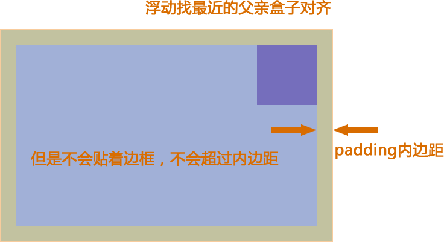

@[toc](浮动)

# 普通流（normal flow）
&emsp;&emsp;这个单词很多人翻译为文档流，字面翻译普通流或者标准流都可以。网页布局的核心，就是用CSS来摆放盒子位置。如何把盒子摆放到合适的位置？CSS的定位机制有3种：普通流（标准流）、浮动和定位。

&emsp;&emsp;普通流实际上就是一个网页内标签元素正常从上到下，从左到右排列顺序的意思，比如块级元素会独占一行，行内元素会按顺序依次前后排列；按照这种大前提的布局排列之下绝对不会出现例外的情况叫做普通流布局。

# 浮动（float）
&emsp;&emsp;浮动最早是用来控制图片，以便达到其它元素（特别是文字）实现“环绕”图片的效果。

```html
<!DOCTYPE html>
<html lang="en">
<head>
    <meta charset="UTF-8">
    <meta name="viewport" content="width=device-width, initial-scale=1.0">
    <title>Document</title>
    <style>
        div {
            width: 500px;
            height: 500px;
            border: 1px solid red;
            margin: 0 auto;
        } 
        img {
            float: right;
        }
    </style>
</head>
<body>
    <div>1991年1月，发行专辑《一起走过的日子》，
        专辑同名主打歌获得十大劲歌金曲奖以及十大中文
        金曲奖[116-117] ；2月，发行粤语专辑
        《爱不完》[118]  ；该专辑发行首日录音带的
        销量达到16万张，而激光唱片的销量则有7.2万
        张[119] ；6月，发行国语专辑《我和我追逐的梦》
        ；同年，获得十大劲歌金曲奖最受欢迎男歌手奖
        [116] 。 1992年，在洛杉矶、旧金山等地举行美
        加巡回演唱会；9月，发行加入 刘德华 刘德华
        (3张) 华纳唱片公司以后的首张专辑《真我的风采》
        ；该专辑发行后销量达到40万张[119] ；同年，在
        提前录制的央视春晚视频中，刘德华与毛阿敏合唱
        歌曲《心中常驻芳华》[120] ；此外，他还发行
        了专辑《谢谢你的爱》，同名主打歌曲获得第十六
        届十大中文金曲奖[121] 。 
        
        1993年1月至2月，
        在香港红袋体育馆举行20场“真我的风采演唱会”；
        4月，推出加入飞碟唱片公司后的首张专辑《真情
        难收》，其中的主打歌曲《一辈子的错》由刘德华
        作词；11月，推出专辑粤语专辑《答案就是你》，
        专辑中的歌曲《永远寂寞》获得第16届十大中文金
        曲获奖[121] 。 1994年，发行国语专辑《忘情
        水》，同名主打歌获得第17届十大中文金曲奖最
        受欢迎国语歌曲金奖以及第1届华语榜中榜Channe
        l [V]中文Top 20榜中榜歌曲奖[122-123] ；
        8月6日至25日，在香港红袋体育馆举行20场演唱
        会；11月25日，发行国语专辑《天意》；专辑中
        表达友情的主打歌曲《友谊历久一样浓》是刘德华
        个人填词的作品；同年，获得十大劲歌金曲奖最受
        欢迎男歌手奖[11] 。</div>
</body>
</html>
```

&emsp;&emsp;后来发现浮动有个很有意思的事情：就是让任何盒子可以一行排列，因此我们就慢慢的偏离主题，用浮动的特性来布局了。

## 什么浮动？
&emsp;&emsp;元素的浮动是指设置了浮动属性的元素会脱离标准普通流的控制，移动到其父元素中指定位置的过程。在CSS中，通过float属性来定义浮动，其基本语法格式如下：

```css
选择器 { float: 属性值; }
```

属性值 | 描述
-|-
left  | 元素向左浮动
right | 元素向右浮动
none  | 元素不浮动（默认值）

```html
<!DOCTYPE html>
<html lang="en">
<head>
    <meta charset="UTF-8">
    <meta name="viewport" content="width=device-width, initial-scale=1.0">
    <title>Document</title>
    <style>
        div {
            width: 200px;
            height: 200px;
            background-color: pink;
            float: left;
        }
        div:nth-child(2) {
            background-color: hotpink;
        }
        div:last-child {
            background-color: deeppink;
        }
    </style>
</head>
<body>
    <div></div>
    <div></div>
    <div></div>
</body>
</html>
```

## 浮动的特性

+ 浮动会脱离标准流，不占位置，会影响标准流
+ 浮动只有左右浮动

&emsp;&emsp;浮动首先创建包含块的概念（包裹），就是说浮动的元素总是找到它最近的父级元素对齐，但是不会超出内边距的范围。

> *__注意：__* 浮动首先需要添加标准流父级别



&emsp;&emsp;浮动的元素排列位置，跟上一个元素（块级）有关系：

+ 如果上一个元素有浮动，则A元素顶部会和上一个元素的顶部对齐
+ 如果上一个元素是标准流，则A元素的顶部会和上一个元素的底部对齐

