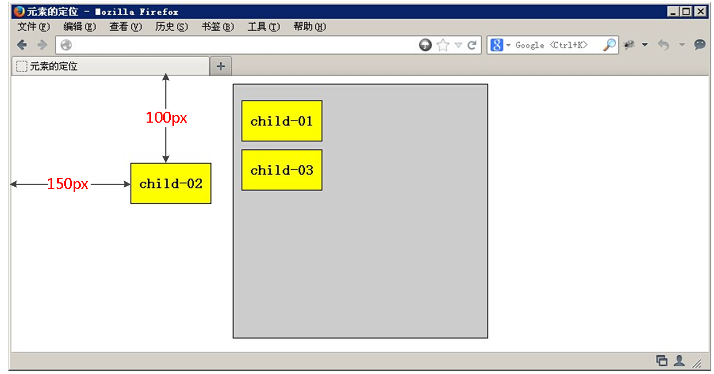

@[toc](定位)

# 元素的定位属性
&emsp;&emsp;元素的定位属性主要包括定位模式和边偏移两部分。

## 边偏移

边偏移属性 | 描述
-|-
top    | 顶端偏移量，定义元素相对于其父元素上边线的距离
bottom | 底部偏移量，定义元素相对于其父元素下边线的距离
left   | 左侧偏移量，定义元素相对于其父元素左边线的距离
right  | 右侧偏移量，定义元素相对于其父元素右边线的距离

&emsp;&emsp;也就说以后定位要和边偏移搭配使用，比如 *__top: 100px;  left: 30px;__* 等。

# 定位模式(定位的分类)
&emsp;&emsp;在CSS中，position属性用于定义元素的定位模式，其基本语法格式如下：

```css
选择器 { position:属性值; }
```

&emsp;&emsp;position属性的常用值

值 | 描述
-|-
static   | 自动定位（默认定位方式）
relative | 相对定位，相对于其原文档流的位置进行定位
absolute | 绝对定位，相对于其上一个已经定位的父元素进行定位
fixed    | 固定定位，相对于浏览器窗口进行定位

## 静态定位（static）
&emsp;&emsp;静态定位是所有元素的默认定位方式，当position属性的取值为static时，可以将元素定位于静态位置。所谓静态位置就是各个元素在HTML文档流中默认的位置。

> 也就是说网页中所有元素默认都是静态定位，其实就是标准流的特性。

&emsp;&emsp;在静态定位状态下，无法通过边偏移属性（top、bottom、left或right）来改变元素的位置。

```html
<!DOCTYPE html>
<html lang="en">
<head>
    <meta charset="UTF-8">
    <meta name="viewport" content="width=device-width, initial-scale=1.0">
    <title>Document</title>
    <style>
        div {
            width: 100px;
            height: 100px;
            background-color: pink;
            position: static;
            left: 100px;
            top: 100px;
        }
    </style>
</head>
<body>
    <div></div>
</body>
</html>
```

> *__注意：__*一般是用来清除定位的

## 相对定位（relative）
&emsp;&emsp;相对定位是将元素相对于它在标准流中的位置进行定位，当position属性的取值为relative时，可以将元素定位于相对位置。

&emsp;&emsp;对元素设置相对定位后，可以通过边偏移属性改变元素的位置，但是它在文档流中的位置仍然保留。如下图所示，即是一个相对定位的效果展示：


```html
<!DOCTYPE html>
<html lang="en">
<head>
    <meta charset="UTF-8">
    <meta name="viewport" content="width=device-width, initial-scale=1.0">
    <title>Document</title>
    <style>
        div {
            width: 100px;
            height: 100px;
            background-color: pink;   
        }
        div:nth-child(2) {
            background-color: purple;
            position: relative;
            left: 20px;
            top: 30px;
        }
    </style>
</head>
<body>
    <div></div>
    <div></div>
    <div></div>
</body>
</html>
```

> *__注意：__*   
> 1. 相对定位最重要的一点是：它可以通过边偏移移动位置，但是原来的所占的位置会继续占有。
> 2. 每次移动的位置，是以自己的左上角为基点移动（相对于自己来移动位置）

&emsp;&emsp;就是说相对定位的盒子仍在标准流中，它后面的盒子仍以标准流方式对待它。（相对定位不脱标）

&emsp;&emsp;如果说浮动的主要目的是让多个块级元素一行显示，那么定位的主要价值就是移动位置，让盒子到我们想要的位置上去。

## 绝对定位（absolute）
&emsp;&emsp;当position属性的取值为absolute时，可以将元素的定位模式设置为绝对定位。

> *__注意：__* 绝对定位最重要的一点是：它可以通过边偏移移动位置，但是它完全脱标，完全不占位置。

```html
<!DOCTYPE html>
<html lang="en">
<head>
    <meta charset="UTF-8">
    <meta name="viewport" content="width=device-width, initial-scale=1.0">
    <title>Document</title>
    <style>
        div:first-child {
            width: 100px;
            height: 100px;
            background-color: pink; 
            position: absolute;
            left: 20px;
            top: 20px;  
        }
        div:last-child {
            width: 200px;
            height: 150px;
            background-color: purple;
        }
    </style>
</head>
<body>
    <div></div>
    <div></div>
</body>
</html>
```

&emsp;&emsp;如果文档可滚动，绝对定位元素会随着它滚动，因为元素最终会相对于正常流的某一部分定位。

### 父级别没有定位
&emsp;&emsp;若所有父元素都没有定位，以浏览器为准对齐(document文档)。



```html
<!DOCTYPE html>
<html lang="en">
<head>
    <meta charset="UTF-8">
    <meta name="viewport" content="width=device-width, initial-scale=1.0">
    <title>Document</title>
    <style>
        .father {
            width: 300px;   
            height: 300px;
            background-color: pink;
            margin: 100px;
        }
        .son {
            width: 100px;
            height: 100px;
            background-color: purple;
            position: absolute;
            top: 15px;
            left: 15px;
        }
    </style>
</head>
<body>
    <div class="father">
        <div class="son"></div>
    </div>
</body>
</html>
```

### 父级别有定位
&emsp;&emsp;绝对定位是将元素依据最近的已经定位（绝对、固定或相对定位）的父元素（祖先）进行定位。 


```html
<!DOCTYPE html>
<html lang="en">
<head>
    <meta charset="UTF-8">
    <meta name="viewport" content="width=device-width, initial-scale=1.0">
    <title>Document</title>
    <style>
        .father {
            width: 300px;   
            height: 300px;
            background-color: pink;
            margin: 100px;
            position: relative;
        }
        .son {
            width: 100px;
            height: 100px;
            background-color: purple;
            position: absolute;
            top: 15px;
            left: 15px;
        }
    </style>
</head>
<body>
    <div class="father">
        <div class="son"></div>
    </div>
</body>
</html>
```

## 子绝父相
&emsp;&emsp;这句话的意思是子级是绝对定位的话，父级要用相对定位。

> *__注意：__* 这个学习定位的口诀，时时刻刻记住的。

&emsp;&emsp;绝对定位是将元素依据最近的已经定位绝对、固定或相对定位的父元素（祖先）进行定位。就是说子级是绝对定位，父亲只要是定位即可（不管父亲是绝对定位还是相对定位，甚至是固定定位都可以）。但在网页布局的时候最常用的子绝父相。

+ 相对定位：占有位置，不脱标
+ 绝对定位：不占有位置，完全脱标

&emsp;&emsp;因为子级是绝对定位，不会占有位置，可以放到父盒子里面的任何一个地方。但父盒子布局时是需要占有位置的，因此父亲只能是相对定位，这就是子绝父相的由来。

## 绝对定位的盒子水平/垂直居中
&emsp;&emsp;普通的盒子是左右margin改为auto就可，但是对于绝对定位就无效了。定位的盒子也可以水平或者垂直居中：

+ 首先设置 *__left: 50%;__* 或者 *__top: 50%__* ，父盒子的一半大小
+ 然后设置 *__margin-left: 负数;__* 或者 *__margin-top: 负数;__* ，该负数为自己宽度或者高度的一半

```html
<!DOCTYPE html>
<html lang="en">
<head>
    <meta charset="UTF-8">
    <meta name="viewport" content="width=device-width, initial-scale=1.0">
    <title>Document</title>
    <style>
        .father {
            width: 800px;
            height: 400px;
            background-color: pink;
            margin: 15px auto;
            position: relative;
        }
        .son {
            width: 100px;
            height: 100px;
            background-color: purple;
            position: absolute;
            left: 50%;
            top: 50%;
            margin-left: -50px;
            margin-top: -50px;
        }
    </style>
</head>
<body>
    <div class="father">
        <div class="son"></div>
    </div>
</body>
</html>
```

## 固定定位（fixed）
&emsp;&emsp;固定定位是绝对定位的一种特殊形式，它以浏览器窗口作为参照物来定义网页元素。当position属性的取值为fixed时，即可将元素的定位模式设置为固定定位。

&emsp;&emsp;当对元素设置固定定位后，它将脱离标准文档流的控制，始终依据浏览器窗口来定义自己的显示位置。不管浏览器滚动条如何滚动也不管浏览器窗口的大小如何变化，该元素都会始终显示在浏览器窗口的固定位置。固定定位有两点：

+ 固定定位的元素跟父亲没有任何关系，只认浏览器。
+ 固定定位完全脱标，不占有位置，不随着滚动条滚动。

```html

```

> *__注意：__* 
> 1. ie6等低版本浏览器不支持固定定位。
> 2. 固定定位一定要给宽高，除非有内容撑开

## 叠放次序
&emsp;&emsp;当对多个元素同时设置定位时，定位元素之间有可能会发生重叠。


&emsp;&emsp;在CSS中，要想调整重叠定位元素的堆叠顺序，可以对定位元素应用z-index层叠等级属性，其取值可为正整数、负整数和0。

```css
z-index: 2;
```

> *__注意：__*
> 1. z-index的默认属性值是0，取值越大，定位元素在层叠元素中越居上。
> 2. 如果取值相同，则根据书写顺序，后来居上。
> 3. 后面数字一定不能加单位。
> 4. 只有相对定位，绝对定位，固定定位有此属性，其余标准流，浮动，静态定位都无此属性，也不可指定此属性。

## 四种定位总结

定位模式 | 是否脱标占有位置 | 是否可以使用边偏移 | 移动位置基准
-|-|-|-
静态static | 不脱标，正常模式 | 不可以 | 正常模式 
相对定位relative | 不脱标，占有位置  | 可以 | 相对自身位置移动
绝对定位absolute | 完全脱标，不占有位置 | 可以 | 相对于定位父级移动位置
固定定位fixed | 完全脱标，不占有位置 | 可以  | 相对于浏览器移动位置

# 定位模式转换
&emsp;&emsp;跟浮动一样，元素添加了绝对定位和固定定位之后，元素模式也会发生转换，都转换为行内块模式。*__因此如果行内元素添加了绝对定位、固定定位后或者浮动后，可以不用转换模式，直接给高度和宽度就可以了。__*


