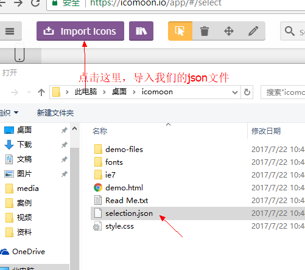

@[toc](CSS精灵和字体图标)

# CSS精灵
## 精灵技术产生的背景
&emsp;&emsp;当用户访问一个网站时，需要向服务器发送请求，网页上的每张图像都要经过一次请求才能展现给用户。然而一个网页中往往会应用很多小的背景图像作为修饰，当网页中的图像过多时，服务器就会频繁地接受和发送请求，这将大大降低页面的加载速度。为了有效地减少服务器接受和发送请求的次数，提高页面的加载速度，就出现了CSS精灵技术（也称CSS Sprites、CSS雪碧）。

## 精灵技术本质
&emsp;&emsp;简单地说，CSS精灵是一种处理网页背景图像的方式。它将一个页面涉及到的所有零星背景图像都集中到一张大图中去，然后将大图应用于网页。这样当用户访问该页面时，只需向服务发送一次请求，网页中的背景图像即可全部展示出来。通常情况下，这个由很多小的背景图像合成的大图被称为精灵图（雪碧图），如下图所示为京东网站中的一个精灵图：


## 精灵技术的使用
&emsp;&emsp;CSS精灵其实是将网页中的一些背景图像整合到一张大图中（精灵图），然而各个网页元素通常只需要精灵图中不同位置的某个小图，要想精确定位到精灵图中的某个小图，就需要使用CSS的 *__background-image__* 、*__background-repeat__* 和 *__background-position__* 属性进行背景定位，其中最关键的是使用 *__background-position__* 属性精确地定位。

```html
<!DOCTYPE html>
<html lang="en">
<head>
    <meta charset="UTF-8">
    <meta name="viewport" content="width=device-width, initial-scale=1.0">
    <title>Document</title>
    <style>
        .mobile {
            width: 15px;
            height: 20px;
            background-image: url(./jds.png);
            background-position: 0 -100px;
        }
    </style>
</head>
<body>
    <div class="mobile"></div>
</body>
</html>
```

# 字体图标
&emsp;&emsp;图片是有诸多优点的，但是缺点很明显，比如图片不但增加了总文件的大小，还增加了很多额外的"http请求"，这都会大大降低网页的性能的。更重要的是图片不能很好的进行"缩放"，因为图片放大和缩小会失真。 

&emsp;&emsp;这时候就出现了字体图标（iconfont)，使用它可以做出跟图片一样可以做的事情，如改变透明度、旋转度等。但是它的本质其实是文字，可以很随意的改变颜色、产生阴影、透明效果等等。而且本身体积更小，但携带的信息并没有削减。几乎支持所有的浏览器，很好的解决移动端设备上的缩放问题。

## 字体图标使用流程
&emsp;&emsp;总体来说，字体图标按照如下流程：


1. 在illustrator或Sketch这类矢量图形软件里创建icon图标，之后保存为svg格式就好了。
2. 当UI设计人员给我们svg文件的时候，我们需要转换成我们页面能使用的字体文件， 而且需要生成的是兼容性的适合各个浏览器的：

+ **icomoon字库** （http://icomoon.io）

&emsp;&emsp;它允许用户选择他们所需要的图标，使它们成一字型。 内容种类繁多，非常全面，唯一的遗憾是国外服务器，打开网速较慢。

+ **阿里icon font字库** (http://www.iconfont.cn/)

&emsp;&emsp;这个是阿里妈妈M2UX的一个icon font字体图标字库，包含了淘宝图标库和阿里妈妈图标库。可以使用AI制作图标上传生成。

+ **fontello** (http://fontello.com/)

&emsp;&emsp;在线定制你自己的icon font字体图标字库，也可以直接从GitHub下载整个图标集，该项目也是开源的。

+ **Font-Awesome** (http://fortawesome.github.io/Font-Awesome/)

+ **Glyphicon Halflings** (http://glyphicons.com/)

&emsp;&emsp;这个字体图标可以在Bootstrap下免费使用。自带了200多个图标。

+ **Icons8** (https://icons8.com/)

&emsp;&emsp;提供PNG免费下载，像素大能到500PX。

3. 网站会把UI做的svg图片转换为字体格式，然后下载下来就好了

4. 引入字体到html

&emsp;&emsp;首先把以下4个文件放入到 fonts文件夹里面：


&emsp;&emsp;在样式里面声明字体：

```css
@font-face {
    font-family: 'icomoon';
    src:  url('fonts/icomoon.eot?7kkyc2');
    src:  url('fonts/icomoon.eot?7kkyc2#iefix') format('embedded-opentype'),
    url('fonts/icomoon.ttf?7kkyc2') format('truetype'),
    url('fonts/icomoon.woff?7kkyc2') format('woff'),
    url('fonts/icomoon.svg?7kkyc2#icomoon') format('svg');
    font-weight: normal;
    font-style: normal;
}
```

&emsp;&emsp;给盒子使用字体：

```css
span {
    font-family: "icomoon";
}
```

&emsp;&emsp;给盒子添加结构：

```css
span::before {
    content: "\e900";
}
```

&emsp;&emsp;或者

```html
<span></span>  
```

> 上面的 "\e900" 和  对应了从网页上下载下来的demo.html中的内容。

## 追加新图标到原来库里面
&emsp;&emsp;如果工作中原来的字体图标不够用了，我们需要添加新的字体图标，但是原来的又不能删除，此时我们需要把压缩包里面的selection.json重新上传，然后选中自己想要新的图标，从新下载压缩包，替换原来文件即可。



