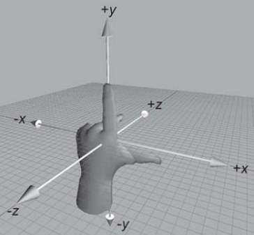
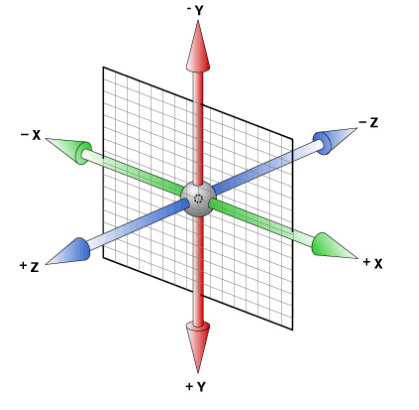

@[toc](CSS新增2D和3D属性)

# 2D变形（transform）
&emsp;&emsp;transform是CSS3中具有颠覆性的特征之一，可以实现元素的位移、旋转、倾斜、缩放，甚至支持矩阵方式，配合过渡和动画的知识可以取代大量之前只能靠Flash才可以实现的效果。

## 移动（translate）
&emsp;&emsp;translate是移动平移的意思：


```css
transform:translate(x,y); /*水平方向和垂直方向同时移动（也就是X轴和Y轴同时移动)*/
transform:translateX(x); /*仅水平方向移动（X轴移动）*/
transform:translateY(Y); /*仅垂直方向移动（Y轴移动）*/
```

+ translate的值可以是像素点或者百分比
+ 如果传入的是百分比，则是以自己的宽度和高度为准
+ x,y的值可以为负数

&emsp;&emsp;让盒子居中对齐的方法：

```html
<!DOCTYPE html>
<html lang="en">
<head>
    <meta charset="UTF-8">
    <meta name="viewport" content="width=device-width, initial-scale=1.0">
    <title>Document</title>
    <style>
        div {
            position: absolute;
            height: 200px;
            width: 200px;
            left: 50%;
            top: 50%;
            transform: translate(-50%, -50%);
            background-color: pink;
        }
    </style>
</head>
<body>
    <div></div>
</body>
</html>
```

## 缩放（scale）
&emsp;&emsp;可以对元素进行水平和垂直方向的缩放：


```css
transform:scale(X,Y); /*使元素水平方向和垂直方向同时缩放（也就是X轴和Y轴同时缩放）*/
transform:scaleX(x); /*元素仅水平方向缩放（X轴缩放）*/
transform:scaleY(y); /*元素仅垂直方向缩放（Y轴缩放）*/
```

&emsp;&emsp;scale()的取值默认的值为1，当值设置为0.01到0.99之间的任何值，作用是使一个元素缩小；而任何大于或等于1.01的值，作用是让元素放大。

```html
<!DOCTYPE html>
<html lang="en">
<head>
    <meta charset="UTF-8">
    <meta name="viewport" content="width=device-width, initial-scale=1.0">
    <title>Document</title>
    <style>
        div {
            position: absolute;
            height: 200px;
            width: 200px;
            left: 50%;
            top: 50%;
            transform: scale(0.5, 1.5);
            background-color: pink;
        }
    </style>
</head>
<body>
    <div></div>
</body>
</html>
```

## 旋转（rotate）
&emsp;&emsp;可以对元素进行旋转，正值为顺时针，负值为逆时针。


&emsp;&emsp;旋转的语法如下：

```css
transform: rotate(45deg);
```

> deg表示度数单位

```html
<!DOCTYPE html>
<html lang="en">
<head>
    <meta charset="UTF-8">
    <meta name="viewport" content="width=device-width, initial-scale=1.0">
    <title>Document</title>
    <style>
        div {
            position: absolute;
            height: 200px;
            width: 200px;
            left: 50%;
            top: 50%;
            transform: rotate(45deg);
            background-color: pink;
        }
    </style>
</head>
<body>
    <div></div>
</body>
</html>
```

## 调整元素转换变形的中心点（transform-origin）
&emsp;&emsp;设置中心点的语法如下：

```css
/* 改变元素原点到左上角，然后进行顺时旋转45度 */
div {
    transform-origin: left top;
    transform: rotate(45deg); 
}    
```

> 如果是4个角，可以用left、top这些；如果想要精确的位置可以用px像素。

```html
<!DOCTYPE html>
<html lang="en">
<head>
    <meta charset="UTF-8">
    <meta name="viewport" content="width=device-width, initial-scale=1.0">
    <title>Document</title>
    <style>
        div {
            width: 200px;
            height: 200px;
            background-color: pink;
            margin: 300px 300px;
            transition: all 0.6s;
            transform-origin: center center;
        }
        div:hover {
            transform: rotate(180deg);
        }
    </style>
</head>
<body>
    <div></div>
</body>
</html>
```

## 倾斜（skew）
&emsp;&emsp;可以使元素按一定的角度进行倾斜，可为负值，第二个参数不写默认为0。


```css
transform:skew(30deg,0deg);
```

&emsp;&emsp;上面的语法是通过skew方法把元素水平方向上倾斜30度，垂直方向保持不变。

```html
<!DOCTYPE html>
<html lang="en">
<head>
    <meta charset="UTF-8">
    <meta name="viewport" content="width=device-width, initial-scale=1.0">
    <title>Document</title>
    <style>
        div {
            margin: 150px auto;
            width: 200px;
            height: 200px;
            background-color: pink;
            transition: all 0.6s;
        }
        div:hover {
            transform: skew(30deg, 30deg);
        }
    </style>
</head>
<body>
    <div>

    </div>
</body>
</html>
```

# 3D变形
&emsp;&emsp;3D变形也是使用transform：

+ 2d：(x,y)  
+ 3d：(x, y, z)

## 左手坐标系
&emsp;&emsp;伸出左手让拇指和食指成"L"形，大拇指向右、食指向上、中指指向前方，这样我们就建立了一个左手坐标系，拇指、食指和中指分别代表X、Y、Z轴的正方向。如下图：



&emsp;&emsp;CSS3中的3D坐标系与上述的3D坐标系是有一定区别的，相当于其绕着X轴旋转了180度，如下图：



&emsp;&emsp;简单记住他们的坐标：

+ x左边是负的，右边是正的
+ y上面是负的，下面是正的
+ z里面是负的，外面是正的

## rotateXYZ
### rotateX()
&emsp;&emsp;就是沿着x立体旋转：

```css
transform:rotateX(180deg);
```

```html
<!DOCTYPE html>
<html lang="en">
<head>
    <meta charset="UTF-8">
    <meta name="viewport" content="width=device-width, initial-scale=1.0">
    <title>Document</title>
    <style>
        img {
            margin: 100px;
            transition: all .6s;
        }
        img:hover {
            transform: rotateX(90deg);
        }
    </style>
</head>
<body>
    
</body>
</html>
```

### rotateY()
&emsp;&emsp;沿着y轴进行旋转：

```css
transform:rotateX(180deg);
```

```html
<!DOCTYPE html>
<html lang="en">
<head>
    <meta charset="UTF-8">
    <meta name="viewport" content="width=device-width, initial-scale=1.0">
    <title>Document</title>
    <style>
        img {
            margin: 100px;
            transition: all .6s;
        }
        img:hover {
            transform: rotateY(180deg);
        }
    </style>
</head>
<body>
    
</body>
</html>
```

### rotateZ()
&emsp;&emsp;沿着z轴进行旋转（相当于垂直于屏幕的那根线）：

```css
transform:rotateZ(180deg);
```

```html
<!DOCTYPE html>
<html lang="en">
<head>
    <meta charset="UTF-8">
    <meta name="viewport" content="width=device-width, initial-scale=1.0">
    <title>Document</title>
    <style>
        img {
            margin: 100px;
            transition: all .6s;
        }
        img:hover {
            transform: rotateZ(180deg);
        }
    </style>
</head>
<body>
    
</body>
</html>
```

## 透视（perspective）
&emsp;&emsp;电脑显示屏是一个2D平面，图像之所以具有立体感（3D效果），其实只是一种视觉呈现，通过透视可以实现此目的。

&emsp;&emsp;透视可以将一个2D平面，在转换的过程当中呈现3D效果。

- 透视原理：近大远小
- 浏览器透视：把近大远小的所有图像，透视在屏幕上
- perspective：视距，表示视点距离屏幕的长短
+ 视点：用于模拟透视效果时人眼的位置

> 并非任何情况下需要透视效果，根据开发需要进行设置。

&emsp;&emsp;perspective一般作为一个属性，设置给父元素，作用于所有3D转换的子元素。理解透视距离原理：


```html
<!DOCTYPE html>
<html lang="en">
<head>
    <meta charset="UTF-8">
    <meta name="viewport" content="width=device-width, initial-scale=1.0">
    <title>Document</title>
    <style>
        body {
            /* 视距越小越明显 */
            perspective: 800px;
        }
        img {
            margin: 100px;
            transition: all .6s;
        }
        img:hover {
            transform: rotateY(80deg);
        }
    </style>
</head>
<body>
    
</body>
</html>
```

## translateX
&emsp;&emsp;仅水平方向移动（X轴移动），
主要目的实现移动效果：


```html
<!DOCTYPE html>
<html lang="en">
<head>
    <meta charset="UTF-8">
    <meta name="viewport" content="width=device-width, initial-scale=1.0">
    <title>Document</title>
    <style>
        body {
            perspective: 800px;
        }
        img {
            margin: 100px;
            transition: all .6s;
        }
        img:hover {
            transform: translateX(150px);
        }
    </style>
</head>
<body>
    
</body>
</html>
```

## translateY
&emsp;&emsp;仅垂直方向移动（Y轴移动）：


```html
<!DOCTYPE html>
<html lang="en">
<head>
    <meta charset="UTF-8">
    <meta name="viewport" content="width=device-width, initial-scale=1.0">
    <title>Document</title>
    <style>
        body {
            perspective: 800px;
        }
        img {
            margin: 100px;
            transition: all .6s;
        }
        img:hover {
            transform: translateY(150px);
        }
    </style>
</head>
<body>
    
</body>
</html>
```

## translateZ
&emsp;&emsp;transformZ的直观表现形式就是大小变化，实质是XY平面相对于视点的远近变化（说远近就一定会说到离什么参照物远或近，在这里参照物就是perspective属性）。比如设置了perspective为200px;那么transformZ的值越接近200，就是离的越近，看上去也就越大，超过200就看不到了，因为相当于跑到后脑勺去了。

```html
<!DOCTYPE html>
<html lang="en">
<head>
    <meta charset="UTF-8">
    <meta name="viewport" content="width=device-width, initial-scale=1.0">
    <title>Document</title>
    <style>
        body {
            perspective: 800px;
        }
        img {
            margin: 100px;
            transition: all .6s;
        }
        img:hover {
            transform: translateZ(-550px);
        }
    </style>
</head>
<body>
    
</body>
</html>
```

## translate3d(x,y,z)
&emsp;&emsp;这是translate的综合写法，其中x和y可以是长度值，也可以是百分比。百分比是相对于其本身元素水平方向的宽度和垂直方向的高度。z只能设置长度值。

```html
<!DOCTYPE html>
<html lang="en">
<head>
    <meta charset="UTF-8">
    <meta name="viewport" content="width=device-width, initial-scale=1.0">
    <title>Document</title>
    <style>
        body {
            perspective: 800px;
        }
        img {
            margin: 100px;
            transition: all .6s;
        }
        img:hover {
            transform: translate3d(100px,100px,-500px);
        }
    </style>
</head>
<body>
    
</body>
</html>
```

## backface-visibility 
&emsp;&emsp;backface-visibility属性定义当元素不面向屏幕时是否可见，可以设置正反面不同图片的效果：

```html
<!DOCTYPE html>
<html lang="en">
<head>
    <meta charset="UTF-8">
    <meta name="viewport" content="width=device-width, initial-scale=1.0">
    <title>Document</title>
    <style>
       div {
           width: 224px;
           height: 224px;
           margin: 100px auto;
           position: relative;
       }
       div img {
           position: absolute;
           top: 0;
           left: 0;
           transition: all 1s;
       }
       div img:first-child {
           z-index: 1;
           backface-visibility: hidden;
       }
       div:hover img {
           transform: rotateY(180deg);
       }
    </style>
</head>
<body>
    <div>  
        
          
    </div>
</body>
</html>
```

## transform-style
&emsp;&emsp;transform-style属性是3D空间一个重要属性，指定嵌套元素如何在3D空间中呈现，主要有两个属性值：

+ flat：表示所有子元素在2d平面呈现（默认值）
+ preserve-3d：所有子元素在3D空间中呈现

```html
<!DOCTYPE html>
<html lang="en">
<head>
    <meta charset="UTF-8">
    <meta name="viewport" content="width=device-width, initial-scale=1.0">
    <title>Document</title>
    <style>
        body {
            perspective: 1000px;
        }
        div {
            width: 100px;
            height: 145px;
            border: 1px solid yellow;
            margin: 140px auto;
            transform: rotateY(30deg);
            transform-style: preserve-3d;
        }
        img {
            transform: rotateY(30deg);
        }
    </style>
</head>
<body>
<section>
    <div>
        
    </div>
</section>
</body>
</html>
```

# 动画
&emsp;&emsp;动画是CSS3中具有颠覆性的特征之一，可通过设置多个节点来精确控制一个或一组动画，常用来实现复杂的动画效果。语法格式：

```css
animation: 动画名称 动画时间 运动曲线  何时开始  播放次数  是否反方向;
```


> 除了名字、动画时间、延时有严格顺序要求其它随意。

&emsp;&emsp;使用动画前首先需要定义动画：

```css
@keyframes 动画名称 {
  from{ 开始位置 }  0%
  to{  结束  }  100%
}
```

```html
<!DOCTYPE html>
<html lang="en">
<head>
    <meta charset="UTF-8">
    <meta name="viewport" content="width=device-width, initial-scale=1.0">
    <title>Document</title>
    <style>
       div {
           width: 100px;    
           height: 100px;
           background-color: pink;
           /* 动画名称是自定义的 */
           animation: go 2s ease 0s infinite alternate;
       }

       /* 定义动画 */
       @keyframes go {
           from {
            transform: translateX(0);
           }
           to {
            transform: translateX(600px);
           }
       }
    </style>
</head>
<body>
    <div>  
       
    </div>
</body>
</html>
```

+ animation-iteration-count:infinite;  无限循环播放
+ animation-play-state:paused;   暂停动画

&emsp;&emsp;还可以做多组动画：

```html
<!DOCTYPE html>
<html lang="en">
<head>
    <meta charset="UTF-8">
    <meta name="viewport" content="width=device-width, initial-scale=1.0">
    <title>Document</title>
    <style>
       div {
           width: 100px;    
           height: 100px;
           background-color: pink;
           /* 动画名称是自定义的 */
           animation: go 2s ease 0s infinite;
       }

       /* 多组动画 */
       @keyframes go {
           0% {
            transform: translate3d(0,0,0);
           }
           25% {
               transform: translate3d(800px,0,0);
           }
           50% {
               transform: translate3d(800px, 400px, 0);
           }
           75% {
               transform: translate3d(0, 400px, 0);
           }
           100% {
               transform: translate3d(0,0,0);
           }
       }
    </style>
</head>
<body>
    <div>  
       
    </div>
</body>
</html>
```