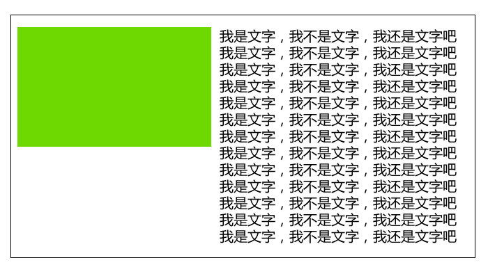

@[toc](BFC)

&emsp;&emsp;BFC(Block formatting context)直译为"块级格式化上下文"。它是一个独立的渲染区域，只有Block-level Box参与，它规定了内部的Block-level box如何布局，并且与这个区域外部毫不相干。

# 元素的显示模式
&emsp;&emsp;元素的显示模式（display）分为：块级元素、行内元素和行内块元素。其实它还有很多其他显示模式：


# 哪些元素会有BFC的条件
&emsp;&emsp;不是所有的元素模式都能产生BFC，w3c规定：display属性为block、list-item和table的元素会产生BFC。这个BFC有着具体的布局特性：


> 有宽度和高度；有外边距margin；有内边距padding；有边框border。

&emsp;&emsp;这些元素不是一开始就是BFC，需要给这些元素添加如下属性就可以触发BFC：

+ float属性不为none
+ position为absolute或fixed
+ display为inline-block, table-cell, table-caption, flex, inline-flex
+ overflow不为visible。

# BFC元素的特性
&emsp;&emsp;BFC布局规则特性：

1. 在BFC中盒子从顶端开始垂直地一个接一个地排列
2. 盒子垂直方向的距离由margin决定，属于同一个BFC的两个相邻盒子的margin会发生重叠
3. 在BFC中，每一个盒子的左外边缘（margin-left）会触碰到容器的左边缘(border-left)（对于从右到左的格式来说，则触碰到右边缘）。
4. BFC的区域不会与浮动盒子产生交集，而是紧贴浮动边缘。
5. 计算BFC的高度时，自然也会检测浮动或者定位的盒子高度。

# BFC的主要作用
## 清除元素内部浮动
&emsp;&emsp;只要把父元素设为BFC就可以清理子元素的浮动了，最常见的用法就是在父元素上设置overflow: hidden样式，对于IE6加上zoom:1就可以了。

> 计算BFC的高度时，自然也会检测浮动或者定位的盒子高度。


```html
<!DOCTYPE html>
<html lang="en">
<head>
    <meta charset="UTF-8">
    <meta name="viewport" content="width=device-width, initial-scale=1.0">
    <title>Document</title>
    <style>
       .father {
           border: 1px solid red;
           /* 创建BFC */
           overflow: hidden;
       }
       .son1, .son2 {
           width: 100px;
           height: 100px;
           background-color: darkblue;
           float: left;
       }
       .son2 {
           background-color: skyblue;
       }
    </style>
</head>
<body>
<section>
    <div class="father">
        <div class="son1"></div>
        <div class="son2"></div>
    </div>
</section>
</body>
</html>
```

## 解决外边距合并问题
&emsp;&emsp;盒子垂直方向的距离由margin决定，属于同一个BFC的两个相邻盒子的margin会发生重叠。那么使它们不属于同一个BFC，就不会发生margin重叠了。


```html
<!DOCTYPE html>
<html lang="en">
<head>
    <meta charset="UTF-8">
    <meta name="viewport" content="width=device-width, initial-scale=1.0">
    <title>Document</title>
    <style>
       .father {
           border: 1px solid red;
       }
       .son1, .son2 {
           width: 100px;
           height: 100px;
           background-color: darkblue;
       }
       .over {
           overflow: hidden;
       }
       .son1 {
           margin-bottom: 50px;
       }
       .son2 {
           background-color: skyblue;
           margin-top: 100px;
       }
    </style>
</head>
<body>
<section>
    <div class="father">
        <div class="over">
            <div class="son1"></div>
        </div>
        <div class="son2"></div>
    </div>
</section>
</body>
</html>
```

## 制作右侧自适应的盒子问题
&emsp;&emsp;BFC的区域不会与浮动盒子产生交集，而是紧贴浮动边缘。普通流体元素BFC后，为了和浮动元素不产生任何交集，顺着浮动边缘形成自己的封闭上下文。



```html
<!DOCTYPE html>
<html lang="en">
<head>
    <meta charset="UTF-8">
    <meta name="viewport" content="width=device-width, initial-scale=1.0">
    <title>Document</title>
    <style>
       .father {
           border: 1px solid #000;
           width: 400px;
           height: 500px;
           margin: 0 auto;
       }
       .box {
           width: 100px;
           height: 100px;
           background-color: pink;
           float: left;
       }
       .txt {
           overflow: hidden;
       }
    </style>
</head>
<body>
<section>
    <div class="father">
        <div class="box"></div>
        <div class="txt">我可以制作右侧的盒子我可以制作右侧的盒子
            我可以制作右侧的盒子我可以制作右侧的盒子我可以制作右侧的盒子
            我可以制作右侧的盒子我可以制作右侧的盒子我可以制作右侧的盒子
            我可以制作右侧的盒子我可以制作右侧的盒子我可以制作右侧的盒子
            我可以制作右侧的盒子我可以制作右侧的盒子我可以制作右侧的盒子
            我可以制作右侧的盒子我可以制作右侧的盒子我可以制作右侧的盒子
            我可以制作右侧的盒子我可以制作右侧的盒子我可以制作右侧的盒子
        </div>
    </div>
</section>
</body>
</html>
```

# BFC总结
&emsp;&emsp;BFC就是页面上的一个隔离的独立容器，容器里面的子元素不会影响到外面的元素，反之也如此。包括浮动、外边距合并等等，有了这个特性，我们布局的时候就不会出现意外情况了。

