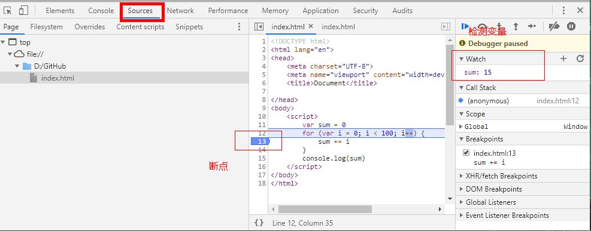

@[toc](表达式和语句)

+ 表达式：一个表达式可以产生一个值，有可能是运算、函数调用，也有可能是字面量。表达式可以放在任何需要值的地方
+ 语句：可以理解为一个行为，循环语句和判断语句就是典型的语句。一个程序有很多个语句组成，一般情况下使用";"分割一个一个的语句。

# 流程控制
## 顺序结构
&emsp;&emsp;从上到下执行的代码就是顺序结构。

## 分支结构
&emsp;&emsp;根据不同的情况，执行对应代码。

### if语句
&emsp;&emsp;语法结构：

```javascript
if (/* 条件表达式 */) {
  // 执行语句
}

if (/* 条件表达式 */){
  // 成立执行语句
} else {
  // 否则执行语句
}

if (/* 条件1 */){
  // 成立执行语句
} else if (/* 条件2 */){
  // 成立执行语句
} else if (/* 条件3 */){
  // 成立执行语句
} else {
  // 最后默认执行语句
}
```

```javascript
var score = 70
if (score < 60) {
    console.log('E')
} else if (score < 70) {
    console.log('D')
} else if (score < 80) {
    console.log('C')
} else if (score < 90) {
    console.log('B')
} else if (score <= 100) {
    console.log('A')
}
```

### 三元运算符
&emsp;&emsp;语法结构：

```javascript
表达式1 ? 表达式2 : 表达式3
```

&emsp;&emsp;表达式1是布尔表达式（返回值是布尔类型），上面的表达式的意思是如果表达式1返回true，则执行表达式2，否则执行表达式3。三元表达式实际上是对 *__if...else__* 语句的一种简化写法，上面的表达式类似于：

```javascript
if(表达式1) {
    表达式2
} else {
    表达式3
}
```

```javascript
var num1 = 12;
var num2 = 13;
console.log(num1 > num2 ? num1 : num2)
```

### switch语句
&emsp;&emsp;语法格式:

```javascript
switch (expression) {
  case 常量1:
    语句;
    break;
  case 常量2:
    语句;
    break;
  case 常量3:
    语句;
    break;
  …
  case 常量n:
    语句;
    break;
  default:
    语句;
    break;
}
```

+ break可以省略，如果省略，代码会继续执行下一个case
+ switch语句在比较值时使用的是全等操作符, 因此不会发生类型转换（例如，字符串'10' 不等于数值 10）

```javascript
var num = 50
switch(parseInt(num / 10)) {
    case 0:
    case 1:
    case 2:
    case 3:
    case 4:
    case 5: console.log('E');break;
    case 6: console.log('D');break;
    case 7: console.log('C');break;
    case 8: console.log('B');break;
    case 9: 
    case 10: console.log('A');break;
}
```

### 布尔类型的隐式转换
&emsp;&emsp;流程控制语句会把后面的值隐式转换成布尔类型：

+ 转换为true：非空字符串、非0数字、true、任何对象
+ 转换成false：空字符串、0、false、null、undefined

```javascript
var message;
// 这里会转换成false
if(message) {
    console.log('Message 赋值了')
} else {
    console.log('Message 没有赋值')
}
```

## 循环结构
&emsp;&emsp;循环结构就是重复做一件事情。

### while语句
&emsp;&emsp;基本语法：

```javascript
// 当循环条件为true时，执行循环体，
// 当循环条件为false时，结束循环。
while (循环条件) {
  //循环体
}
```

```javascript
var i = 1
while( i++ <= 100 ) {
    if (i % 2 === 0) {
        console.log(i)
    }
}
```

### do...while语句
&emsp;&emsp;基础语法：

```javascript
do {
  // 循环体;
} while (循环条件);
```

&emsp;&emsp;do..while循环和while循环非常像，二者经常可以相互替代。但是do..while的特点是不管条件成不成立，都会执行一次。

```javascript
var i = 1
var sum = 0
do {
    if (i % 3 === 0) {
        sum += i
    }
}while(++i < 100)
console.log(sum)
```

### for语句
&emsp;&emsp;for循环语法：

```javascript
// for循环的表达式之间用的是;号分隔的，千万不要写成,
for (初始化表达式1; 判断表达式2; 自增表达式3) {
  // 循环体4
}
```

&emsp;&emsp;while和do...while一般用来解决无法确认次数的循环，而for循环一般在循环次数确定的时候比较方便。

```javascript
var star = "";
for (var i = 0; i < 10; i++) {
    for (var j = 0; j <= i; j++) {
        star += "*"
    }
    star += "\n"
}
console.log(star)
```

### continue和break

+ break:立即跳出整个循环，即循环结束，开始执行循环后面的内容（直接跳到大括号）
+ continue:立即跳出当前循环，继续下一次循环（跳到i++的地方）

```javascript
// 输出 1  2  
for (var i = 1; i < 10; i++){
    if (i % 3 === 0) {
        break
    }
    console.log(i)
}

// 1  2  4  5  7  8
for (var j = 1; j < 10; j++) {
    if (j % 3 === 0) {
        continue
    }
    console.log(j)
}
```

# 调试
&emsp;&emsp;调试的目的是确定错误的原因和位置并解决错误，错误可以分为：

+ 语法错误：浏览器可以直接显示
+ 逻辑错误：需要自己去检查

&emsp;&emsp;过去调试JavaScript的方式：

+ alert()
+ console.log()

## 断点调试
&emsp;&emsp;断点调试是指自己在程序的某一行设置一个断点，调试时程序运行到这一行就会停住，然后你可以一步一步往下调试。调试过程中可以看各个变量当前的值，出错的话调试到出错的代码行即显示错误并且停下。调试步骤如下：

+ 浏览器中按F12
+ sources
+ 找到需要调试的文件
+ 在程序的某一行设置断点



&emsp;&emsp;调试中的相关操作

+ Watch（监视）：通过watch可以监视变量的值的变化，非常的常用。
+ F10: 程序单步执行，让程序一行一行的执行，这个时候可以观察watch中变量的值的变化。
+ F8：跳到下一个断点处，如果后面没有断点了，则程序执行结束。

> *__注意：__* 监视变量，不要监视表达式。因为监视了表达式，那么这个表达式也会执行。